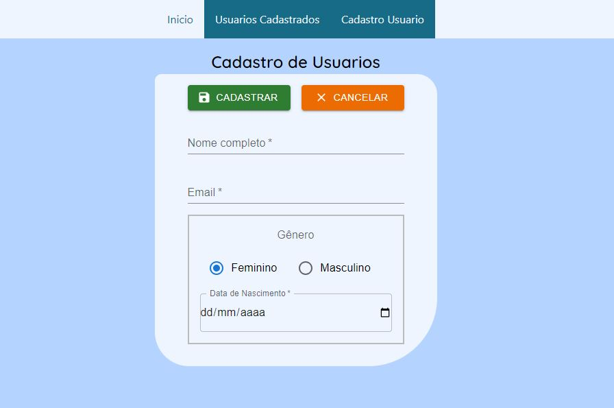

<h1>To Do List em React ✅ 
<h2>Finalidade</h2>

Com estudos recentes em Express e Fetch API, resolvi colocar em pratica. Não vou negar que deu um pouco de trabalho porque a parte de BackEnd é muito recente para mim, sendo que meu foco é no Front. Mas enfim, tenho que me desafiar e também obter conhecimento mais amplo. Usando novas bibliotecas que venho estudando como: Yup e Formik, Material Ui e o framework Tailwind CSS para responsividade, eu construi essa aplicação de cadastro e consulta de "usuarios". Para conferir, so clicar na imagem abaixo: 

